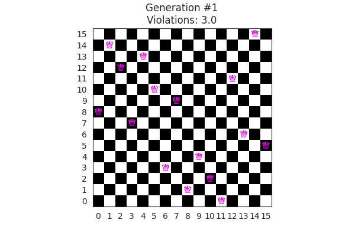
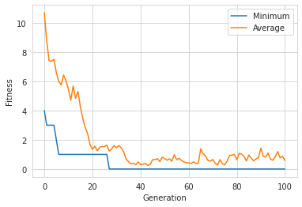

best individual: [3, 10, 14, 7, 2, 0, 6, 12, 15, 8, 4, 13, 1, 9, 11, 5]
 fitness: (0.0,)

# 👑 N-Queens Problem
#### Statement:
Place $N$ chess queens on an $N \times N$ chessboard in such a way that no two queens threaten each other. The original problem was called the eight-queen puzzle where the task was to place eight chess queens on the $8\times8$ board without any two of them threatening each other.

This repo solves 16-Queens problem but can be used for any arbitrary number of queens for which solution exists. N-Queens problem is known to have a solution for any natural number $n$ except for $n=2$ and $n=3$. 

The problem is solved using a genetic algorithm and python framework [DEAP](https://deap.readthedocs.io/en/master/).

## ⚙️ Usage
```bash
git clone https://github.com/SrjPdl/N-Queens-Problem-GA.git
pip install -r requirements.txt
```
If `pip` doesn't work use `pip3` instead of `pip`.
If there is problem in gif compression, install pygifsicle using 
```bash
sudo apt-get install gifsicle
```
## 🛠️ Solution Definition
The solution is represented as a list of integers $[i_1, i_2, ..., i_N]$ where $i_k$ is the row number of the queen in column $k$ on the chessboard and $N$ is the number of queens to be placed on $N \times N$ board.

## Solution Simulation


## Results
#### 📉 Generation v/s Fitness


#### One of the Best Individual
```python
best individual: [3, 10, 14, 7, 2, 0, 6, 12, 15, 8, 4, 13, 1, 9, 11, 5]
fitness: (0.0,)
```

## Author
**Suraj Poudel**

## License
[](https://opensource.org/licenses/MIT)